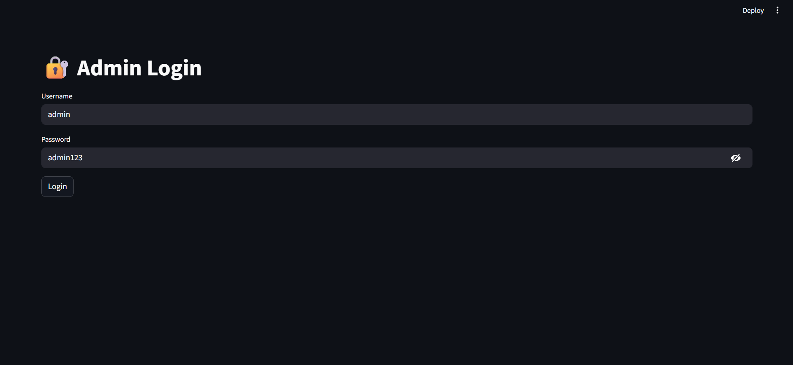
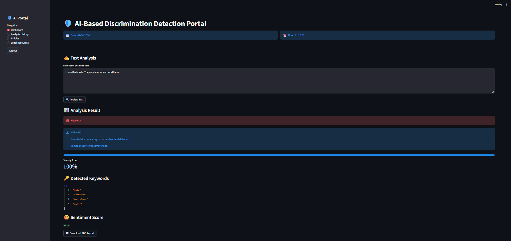
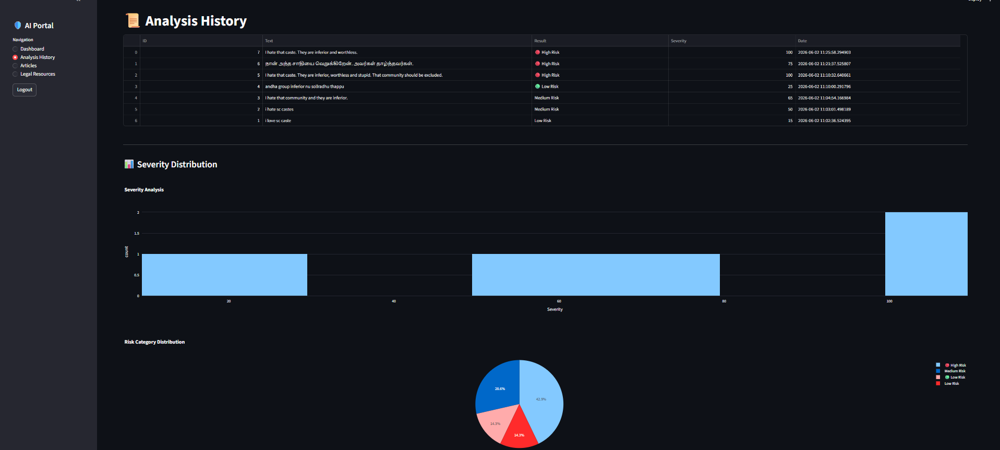
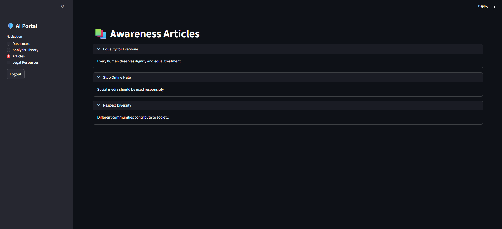
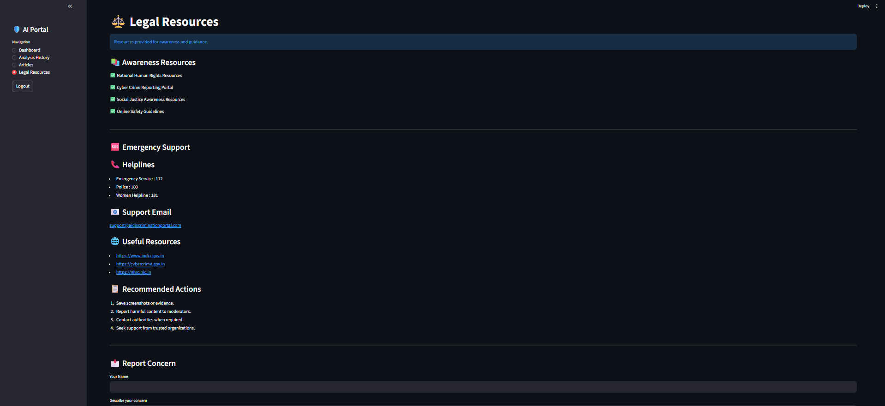

# AI Discrimination Detection Portal

AI-powered Tamil and English discrimination detection portal with severity analysis, PDF reporting, analytics dashboard, awareness resources, and admin login.

## Dashboard Screenshots

### Login Page

### Main Dashboard

### Text Analysis

### Analytics Dashboard

### Legal Resources

## Features

- Tamil + English Text Analysis
- Low / Medium / High Risk Detection
- Severity Score
- PDF Report Generation
- Analysis History
- Charts & Graphs
- Awareness Articles
- Legal Resources
- Admin Login
- Report Concern Form

## Technologies Used

- Python
- Streamlit
- SQLite
- Plotly
- TextBlob
- Git & GitHub

## Author

Ishwariya
